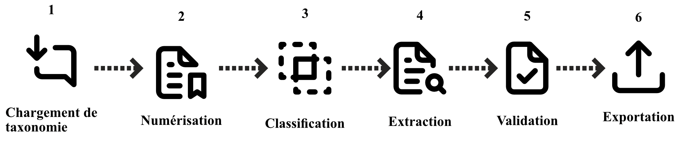

<!--
    Version du 2018-03-30 - Louis Martin
-->

<!-- Page de titre -->
\begin{titlepage}
    \begin{center}
    { \setstretch{1.2} \large
        \MakeUppercase{
            { \Large Université du Québec à Montréal }
            \vfill
            Le besoin en RPA pour la vérification de documents, \break
            étude de cas dans le cadre de l'industrie bancaire.
            \vfill
            RAPPORT D’ACTIVITÉ DE SYNTHÈSE\break
            présenté comme exigence partielle\break
            DE LA MAÎTRISE EN INFORMATIQUE DE GESTION
            \vfill
            par \break Oussama Chouk
            \vfill
            Mars 2020
        }
    }
    \end{center}
\end{titlepage}

<!-- Pagination en chiffre romain au départ -->
\pagenumbering{roman}
\setcounter{page}{2}

# Remerciements {-}

Cette section est optionnelle.

<!-- Optionnellement, inclure ci-après la dédicace -->
<!-- La dédicace est justifiée à droite -->

# Dédicace {-}

\begin{flushright} {\itshape

Je dédie cette recherche à ma femme et à mes enfants \break
qui ont été ma source continue d’encouragement et de motivation \break
pour surmonter tous les défis.

} \end{flushright}
<!-- Commandes pour la génération de la table des matières et des pages associées -->

\tableofcontents

\listoffigures

\listoftables

\lstlistoflistings
<!-- Optionnellement, inclure ci-après les abréviations, sigles et acronymes -->
# Liste des abréviations, sigles et acronymes {-}

ADC
  ~ Avis de cotisation

DSR
  ~ *Design science research*

IA
  ~ Intelligence artificelle

IPA
  ~ *Intelligent process automation* 

MIG
  ~ Maitrise en informatique de gestion

NAS
  ~ Numéro d'assurance social
  
RDA
  ~ *Robotic desktop automation*

RPA
  ~ *Robotic process automation*

ROC
  ~ Reconnaissance Optique de Caractères

SI
  ~ Systèmes d'information

UQAM
  ~ Université du Québec à Montréal

<!-- Forcer une fin de page, la pagination est remise en chiffre romain et le compteur de page à un, l'espacement entre les lignes est augmenté  -->

\singlespacing
\cleardoublepage
\setcounter{page}{1}
\pagenumbering{arabic}
\onehalfspacing

<!-- Inclure ci-après le corps du mémoire dans l'ordre désiré -->

# INTRODUCTION {-}

La transformation numérique pousse à innover continuellement les entreprises pour pouvoir s’adapter à un monde hyper-connecté et en constante mutation.
Ces innovations touchent essentiellement le modèle commercial, les processus d’affaires et la culture organisationnelle des entreprises.[@Océane_2019]
Cette révolution technologique implique souvent l’introduction des nouvelles technologies, des améliorations logicielles et l’adoption de nouveaux procédés émergents.

L’automatisation des processus robotisés(RPA) est une nouvelle technologie révolutionnaire conçue pour faciliter l'exécution rapide d'un grand nombre de tâches à faible degré de complexité. L’idée principale est de créer et de déployer des robots qui vont imiter des agents humains dans les tâches répétitives avec une précision accrue et des risques d’erreurs quasi nulles. [@leshob_2020]
La RPA est très attrayante et progresse rapidement surtout dans les industries de services (assurances, banques, etc.).

Ce document est une proposition pour l’activité de synthèse à la maitrise en informatique de gestion de l’UQAM, se composant éventuellement de quatre chapitres: 
Nous allons établir dans le premier chapitre le contexte et l’objectif de cette recherche.
Le second chapitre fera le survol de la littérature pour mieux éclaircir les théories et les concepts de la robotisation des processus.
Dans le troisième chapitre, nous allons justifier l’approche méthodologique de la science de la conception choisie pour cette recherche, ensuite, nous présenterons les étapes que nous estimons nécessaires pour l’atteinte de nos objectifs.
Le quatrième chapitre présentera l'échéancier des travaux de cette recherche.

# PROBLÉMATIQUE ET OBJECTIF DE RECHERCHE

## Mise en contexte

Le marché canadien de la dette a des impacts considérables sur la croissance économique, donc influence directement la politique monétaire du pays. Une étude récente de statistique Canada montre que les ménages canadiens doivent 1,76 $ pour chaque dollar de revenu net pour un total de 2,3 trillions de dollars, dont 65 % sont liées au crédit hypothécaire. [^petite_note_1]

Un marché de cette envergure exige une réglementation rigide et en constante évolution notamment après la « récente » crise financière de 2008, pendant laquelle plusieurs questions ont été soulevées, car les prêts hypothécaires américains ont été, à l’été 2007, le catalyseur de la crise financière. En effet, les banques ont fait des prêts à des taux raisonnables à des acheteurs n’ayant pas nécessairement le salaire approprié pour payer les taux d’intérêt. [^petite_note_2]

Par conséquent, la bonne compréhension des sources de revenus des demandeurs est donc primordiale pour l’analyse des demandes de crédit, pour cerner le risque de défaut de paiement et de la solvabilité des clients. Une diligence raisonnable de la part des institutions est requise d’une façon régulière lors de la confirmation des revenus, car cela a des implications importantes, dont la détection de fraudes et la lutte contre le blanchiment d’argent.

Cette constante évolution du marché de la dette exige aux institutions financières une constante réflexion d’ordre managérial, produit et opérationnel sur l’innovation. Au cours des dernières années, diverses acquisitions et fusions ont eu lieu, ce qui a entraîné une augmentation de la concurrence dans les services financiers.

L’adoption de l’automatisation des processus robotisés (RPA) se fait de plus en plus sentir dans les opérations bancaires. En effet les dépenses de RPA dans les services bancaires et financiers étaient estimées à 200 millions de dollars en 2018 et on estime une augmentation à 1,2 milliard de dollars en 2023 [@gregoryscott].

[^petite_note_1]:www150.statcan.gc.ca/t1/tbl1/en/cv.action?pid=3810023801
[^petite_note_2]:ici.radio-canada.ca/nouvelle/1123866/crise-financiere-2008-faillite-lehman-brothers-subprimes-bulle-immobiliere-etats-unis-dette-surendettement

## Présentation de la problématique

L’analyse des dossiers de crédit hypothécaire est un travail complexe, régi par une réglementation rigoureuse, une concurrence ardente et un besoin incessant d’innovation.
Durant cette décennie, on a vu l’adoption des RPA dans plusieurs aspects du service financier, présentement, la majorité des dossiers soumis par les canaux de ventes est auto traitée par le système. Cela a permis aux banques d’améliorer leurs services aux clients avec une considérable réduction des délais d’attente. Le processus de révisions prenait plusieurs jours, mêmes semaines, se fait maintenant approuver instantanément. Les Systèmes d’Information (SI) derrière tout ça, peut évaluer le risque de crédit en se basent sur l’information fournie.

Dans le monde des affaires, il ne faut pas faire de compromis sur la vitesse, l’efficience et la qualité. L’automatisation ne peut avoir lieu sans numérisation. En termes simples, la numérisation est la pierre angulaire de notre parcours vers la transformation numérique.
Cependant, la confirmation des revenus à ce jour est traitée d’une façon manuelle. La révision des documents historiques (avis de cotisations, T4, etc.) et des documents courants (talons de paies, dépôts directs, lettre d’emploi, etc.) demande une très bonne compréhension des lois fiscales et des procédés qui règlementent le marché.

\blandscape

 

\elandscape

Ce processus est un ensemble de tâches routinières à effectuer pour s’assurer en premiers lieux de l’exactitude des informations (exemples : (même numéro d’assurance sociale, même adresse...). L’analyste doit faire attention aux signes potentiels de fraudes dans ces documents : l’usage de différentes polices de caractères, fautes d’orthographe, dépôts suspects aux guichets, etc.

En deuxième étape, l’analyste doit s’assurer que les sources de revenues courantes sont vérifiables et s’aligne avec les revenus historiques. Cette tâche va permettre de dresser le profil général du client et d’analyser le caractère raisonnable de la demande. Exemple : S’il existe une variance considérable entre le revenu d’emploi courant et celui des années précédentes, est-ce qu’il existe une explication justificative à ça (exemple : prestations d’invalidité temporaire).  
On essaye ainsi de comprendre la situation financière des clients et de s’assurer qu’ils ont une capacité financière suffisante à servir la dette.
Ces tâches sont la partie la plus fastidieuse dans l’analyse d’une application de crédit hypothécaire. La demande est généralement soumise par un1 à quatre4 codemandeurs avec des types de revenus différents (Salarié, travailleur autonome, retraité, etc.).

Une étude faite en recensant les données opérationnelles chez 5 analystes de crédit à l'institution financière [^petite_note_3] à montrer qu’en moyenne ça prend 45 minutes pour la révision d’un dossier de crédit et 40 % de ce temps alloué pour la révision des sources de revenus. Ce qui représente (45 x 0,4 =18 minutes/applications de crédit). L’automatisation de cette étape de traitement aura un effet domino sur tout le processus. Un analyste fait en moyenne 8 dossiers par jours donc on a un gain total de 144 minutes par jour ou 3.2 dossiers supplémentaires. Ainsi, pour un centre de 60 analystes, ceci représente une capacité supplémentaire de 192 dossiers traités/jours. 
La confirmation manuelle pose aussi des problèmes de qualité et représente une importante partie des défaillances lors des audits interne et externe. Cela est dû au gros nombre de documents qu’on reçoit (Exemple : les avis de cotisations fédéraux des deux dernières années représentent 10 pages à vérifier).\break
Finalement la confirmation manuelle demande, pour certains, beaucoup d’impressions de documents physiques, ce qui est à l’encontre de la stratégie d’optimisation de flux de l’information de l’industrie et l’image de marque « 0 papier ».

## Questions de recherche

Pour réaliser ce projet, nous posons la question suivante : 
Comment intégrer les RPA pour éliminer les tâches routinières de confirmation de revenus afin d’améliorer l’efficience et la qualité de ce processus ? 
Cette question est indispensable à l’amélioration de l’expérience client. En effet, les clients veulent que leurs demandes soient traitées toujours plus rapidement et exigent un service de plus en plus optimal. En plus cela permettra une meilleure gestion des tâches routinières.\break
Pour nous aider à développer un artéfact qui s’aligne avec cette question, on va explorer les innovations acquises en « Traitement intelligent des documents » et son application en RPA, ainsi les sous-questions suivantes ont été développées.
- *I. Quelles sont les options d'automatisations offertes ?* 
- *II. Comment intégrer les robots dans le processus courant?*

[^petite_note_3]:Pour des raisons de confidentialité, nous allons omettre de mentionner le nom de cette banque canadienne.

## Objectifs de recherche

L’objectif de ce travail de recherche est de concevoir un artéfact pour le traitement intelligent des documents qui sera adapté au système bancaire canadien et qui aidera à réinventer le processus de traitement des applications de crédit.
Cela relève d’une bonne compréhension des RPA d’une manière générale et, en particulier, l’application du *machine learning* pour le traitement automatisé des documents de revenus.\break
Pour atteindre cet objectif, on va commencer par définir un cadre de travail qui favorise l’implémentation de l’artéfact. Une recherche sur les facteurs de succès pour l’implémentation d’un RPA sera ainsi définie. Ensuite, on regardera les options offertes actuellement pour le traitement de documents, où une approche couts-bénéfices sera dressée.\break
On développera par la suite un artéfact qui sera soutenable à l’industrie bancaire canadienne et qui prendra en charge l’implémentation de l’expertise d’un analyste de crédit pour automatiser les tâches routinières de la confirmation des revenus.\break
La démarche employée est le design science selon les trois boucles d’activités : rigueur, pertinence et design [@Pascal_2012].

\newpage# REVUE DE LITTÉRATURE

Dans ce présent chapitre, on va présenter le concept de la transformation numérique comme garant de survie des entreprises, on va établir ses caractéristiques et ses facteurs de succès. En deuxième partie, on abordera une catégorie de cette transformation que sont les RPA, on établira la liste des avantages et des inconvénients pour finir avec les opportunités futures que l’intégration de l’intelligence artificielle (IA) peut apporter.

## La transformation numérique

La technologie fusionne de plus en plus avec le quotidien des humains. Les frontières s’estompent entre l’ensemble physique, numérique et biologique [@Schwab_2014] comme les voitures autonomes, la reconnaissance biométrique ou le diagnostic médical assisté par IA. Ces innovations technologiques prennent de plus en plus d’importance dans nos vies.
Schwab, K considère la transformation numérique comme la quatrième révolution industrielle., il identifie trois caractéristiques assez différentes des autres révolutions industrielles.

### Vitesse

Contrairement aux évolutions linéaires vécues dans le passé, on passe à une vitesse exponentielle. En effet, il a fallu 75 ans pour que 100 millions d’utilisateurs adoptent le téléphone. Par ailleurs, en 15 mois seulement, le jeu Candy Crush a atteint le même nombre d’utilisateurs[@ref]. La transformation numérique est en plein essor et continue de s’accélérer, puisque les statistiques démontrent que le nombre de demandes de brevet incluant l’expression « intelligence artificielle » ou « apprentissage machine » publiées par l’Office américain des brevets et des marques (USPTO) est passé de 406 publications en 2009 à 4 091 publications en 2019 (projection à partir des statistiques disponibles le 11 septembre 2019) . En d’autres termes, ce n’est pas qu’une mode passagère, mais plutôt une réalité à laquelle les entreprises doivent s’adapter.

### Ampleur

Cette révolution industrielle est en train de modifier en profondeur le monde tel qu’on le connait. Elle impacte le comportement des consommateurs, l’organisation des entreprises et le rôle des collaborateurs [@zaki_2019]. Une nouvelle compréhension des modèles d’affaires est indispensable pour adopter ces nouveaux paradigmes [@kotarba_2018]. Les entreprises adoptent de nouvelles technologies pour rendre leurs activités plus efficaces comme elles ont adopté la machine à vapeur lors de la première révolution industrielle. La survie des compagnies modernes dépend essentiellement des bonnes décisions qui ont était prises [@berthold_2010], cela explique l’émergence des logiciels d’aide à la décision et de l’intelligence d’affaires, ce qui va favoriser l’établissement  d’un écosystème de  coopération, de coordination et de collaboration [@Pappas_2018].

### Complexité et impact sociétal

Plusieurs technologies imposent une réflexion sur les enjeux éthiques et sociaux de cette révolution. Exemple : la robotisation des processus, l’intelligence artificielle ou l’apprentissage automatique. 
Parmi ces enjeux les plus importants, on peut citer :\break
- La vie privée : que ce soit l’industrie alimentaire, les banques ou les épiceries, ces entités se transforment progressivement en entreprises technologiques. Passant au numérique, toutes ces compagnies génèrent un volume considérable de données [@Pappas_2018]. Les utilisateurs s’interrogent de plus en plus sur l’usage de leurs données privées et si ces compagnies n’en savent pas un peu trop sur eux [@Reinartz_2019].\break
- Employabilité : de nombreux spécialistes se préoccupent du fait que l’IA pourrait engendrer un chômage de masse (en raison d’une automatisation croissante des emplois), même s’il faut quelque peu tempérer ces craintes. Selon [@Frey_2017]  47 % des tâches seront automatisées. Les analystes sont d’accord sur les changements structuraux du marché de travail. La polarisation de l’emploi décrit un changement dans le marché de travail, où les emplois qualifiés sont évidés et une augmentation d’une manière disproportionnée des emplois à faibles ou très hautes qualifications [@Hirschi_2018].
Même si cela semble inquiétant pour certains, plusieurs exemples récents d’entreprises qui investissent massivement dans l’IA et l’automatisation constatent que les innovations, les plus efficientes et les plus rentables sont les résultats d’une collaboration humains-machines. [@ref2]
Cela démontre l’intérêt et l’émergence de le RPA dans cette dernière décennie.

## L’automatisation robotisée des processus

Parmi les multiples facettes de la transformation numérique on va se concentrer sur le RPA car tel qu’était établi précédemment on ne peut parler de transformation numérique sans la numérisation des données, d’où viennent les besoins des RPA [@Leopold_2018].

Dans son livre *The Robotic Process Automation Handbook* [@taulli_2020], Tom Taulli énumère trois versions de RPA, ce qui représente trois grandes évolutions dans l’histoire de cette technologie :\break
1.	RPA supervisé : représente la première génération (2003) de RPA que l'on connaît également sous le nom de *robotic desktop automation* (RDA) et qui est une collaboration entre le logiciel et l’utilisateur pour l’exécution de certaines tâches. Exemple : un RPA qui vérifie les informations du client quand le représentant est en train de prendre l’appel téléphonique.\break   
2.	RPA non supervisé : représente la deuxième génération de RPA. Celle-ci peut effectuer des tâches d’une façon autonome. Les robots sont déclenchés avec des événements et leurs exécutions sont indépendantes de toute intervention humaine.\break 
3.	RPA intelligent : *Intelligent process automation* (IPA) est la plus récente génération de RPA. Le logiciel utilise sa propre intelligence pour prendre des décisions sur l’exécution des tâches. Exemple : l’apparition de la lecture intelligente des documents.\break 

Le RPA a suscité énormément d’intérêt ces deux dernières années, et qui est en train de révolutionner notre milieu de travail. Dans sa forme la plus simple, c’est l’implémentation de robots logiciels pour interagir avec multiples systèmes d’informations d’une entreprise. Avec une série d’instructions, on peut déléguer les tâches fastidieuses et répétitives à un robot et libérer ainsi les ressources humaines (les travailleurs) pour consacrer leurs efforts aux tâches à valeur ajoutée. Exemple : extraire des données, remplir des formulaires ou contrôler des processus [@anagnoste_2017].

Les RPA sont là pour complémenter les systèmes de gestion des processus d’affaires et non pour les remplacer affirme le directeur marketing de *Blue prisme* (un leader de solutions RPA) « … Les humains peuvent être redéployés vers des tâches décisionnelles. » 
Dans un milieu de travail transactionnel à haut volume dans lequel la vitesse, la fiabilité, la cohérence et la précision sont des exigences essentielles, les RPA permettent aux entreprises de  sauver en effectif de remplacements *offshore* [@lacity_2015], D’exécuter les tâches répétitives d’une façon plus efficiente, améliore la qualité du service, une grande précision, un délai d’exécution plus rapide et augmente la conformité.
Le secteur bancaire, par exemple, est sous pression pour fournir des services ininterrompus et leurs marges bénéficiaires sont en baisse. Alors, la RPA est aujourd’hui la version de l’externalisation technologique idéale. La RPA est rapide et rentable avec un retour sur investissement (ROI) tangible pour les banques.

Bien qu’il soit récent, ce type d’automatisation est progressivement utilisé, mais à mesure qu’il se généralise, il y a des défis que les entreprises doivent relever et tenir compte afin d’automatiser avec succès leurs processus. L’un des défis est l’identification des processus adaptés à l’automatisation de RPA [@Leopold_2018]. Dans leurs publications *Identifying Candidate Tasks for Robotic Process Automation in Textual Process Descriptions*, les auteurs présentent une approche révolutionnaire pour classifier les tâches d’un processus d’affaires. En se basant sur la description textuelle des tâches et de « Machine learning » et le traitement du langage naturel, ils ont pu classifier correctement 342/424 des processus.

Lorsqu’elle est implémentée de manière appropriée (c.-à-d. des règles bien définies qui s’alignent avec le processus d’affaires), la RPA présente aussi plusieurs avantages aux collaborateurs : \break
En remplaçant les humains par des robots pour effectuer des travaux répétitifs, les  travailleurs peuvent se concentrer sur les tâches les plus importantes qui impliquent de l’analyse critique et la gestion des exceptions, la satisfaction au travail ainsi que la rétention des employés augmentent [@slaby_2012]. Le maintien et le contrôle de ces robots permettent aussi de créer de nouvelles opportunités d’emploi [@asatiani_2016]. \break
Une étude de cas élaborée chez *Telefónica* a présenté un modèle très intéressant pour mettre en contexte les besoins d’automatisation et qui s’aligne avec le modèle établi par [@Frey_2017].

![La bande automatisable [@lacity_2015][^petite_note_4]](images/Telefonica.PNG) 

L’expérience démontre qu’il est plus approprié d’automatiser les processus routiniers simples à grand volume, plus la complexité des tâches augmente plus ça devient difficile d’implémenter une RPA [@lacity_2015]. L’humain est capable de prendre de petites décisions qui se basent sur le gros bon sens. Dans le cas des automates, il faut explicitement définir les règles de contrôle. En d’autres termes, le manque de compétences cognitives nécessite des règles plus rigoureuses afin d’exécuter ces tâches avec succès. Si le processus contient beaucoup d’exceptions, il doit être remis aux travailleurs [@santos_2019]. Pour réussir l’implémentation d’automatisations, une bonne compréhension des règles et du *workflow* est donc indispensable.

La RPA est aussi une solution temporaire pour automatiser les processus basés sur les systèmes hérités. À long terme, il serait peut-être plus approprié de mettre fin aux SI hérités et d’en reconstruire de nouveaux [@asatiani_2016].

[^petite_note_4]:Interprété de l’étude de cas chez *Telefónica*

## L’automatisation intelligente des processus ou RPA 2.0

Présentement, il existe plusieurs approches et critères pour déterminer les taches automatisables, des taches à très grands volumes avec un faible degré de complexité [@asatiani_2016] [@leshob_2018], selon niveau de maturation du processus, selon les fonctions et l’industrie de ses taches[@madakam_2019] etc.  
Mais la littérature scientifique n’est pas encore décidée sur l’intégration de RPA avec l’apprentissage machine ou l’IA. L’identité même de ces IPA n’est pas encore claire, car tout simplement il n’existe pas assez de recherche dans ce domaine. Les IPA peuvent effectuer des automatisations plus complexes en utilisant l’IA pour ajouter cet aspect décisionnel[@chakraborti_2020]. Les tâches les plus complexes peuvent être traitées par des machines [viehhauser_2020]. L’utilisation des capacités cognitives de l’IA sème aussi de la confusion dans les définitions. Il faut comprendre que l’IPA est tout d’abord un robot axé sur l’automatisation des processus qu’on lui ajoute une couche d’intelligence sous forme d’apprentissage machine ou traitement naturel de langues [@anagnoste_2018]

L’automatisation intelligente peut aider à gérer des règles d’affaires plus complexes avec une meilleure flexibilité de surmonter les limitations des RPA [@anagnoste_2018]. On peut extraire et traiter intelligemment du texte, cela permettra une meilleure capabilité à gérer un contenu non structuré comme des documents et d’extraire des caractéristiques comme les intentions et les sentiments des utilisateurs [@le_2017]. Les opportunités pour l’automatisation intelligente peuvent affecter tous les niveaux de l’entreprise [@anagnoste_2018].

Une lecture de l’état de l’art actuel démontre un dilemme pour les IPA, tout d’abord il faut souligner que l’automatisation intelligente des processus est plus efficace avec une utilisation restreinte de données. Dans l’étude de [@viehhauser_2020], l'auteur explique que même si les robots commencent à obtenir des fonctionnalités « intelligentes », telles que la reconnaissance d’images, les recherches révèlent que la mesure dans laquelle la ROC fait partie de la RPA est très limitée et la majorité des fournisseurs de logiciels RPA ne considèrent pas la ROC comme une partie essentielle de la RPA. De plus, aucune des solutions présentes sur le marché n’est capable de capturer des données complexes et non structurées provenant de sources telles que la voix ou le son. Côté traitement, aucun des fournisseurs RPA ne fournit du traitement du langage naturel (NLP) ou de raisonnement automatisé. Ils sont considérés comme des technologies complexes et non essentielles.

Il faut aussi souligné que contrairement aux RPA dont la potentielle réduction de temps de cycle et des économies de coûts allant jusqu’à 30 % [@lacity_2015], il y a un coût plus important pour le développement d’IPA, car ça nécessite une préparation assidue de données (identification des données pertinentes, nettoyage et transformation) et l’ingénierie des fonctionnalités (extraction des fonctionnalités appropriées), avant de construire et de valider les capacités cognitives. [@bosco_2019]

## Contribution de la recherche et conclusion

L’automatisation intelligente est un domaine qui est très peu exploité, mais les preuves de concepts récentes prouvent un futur impact imminent sur l’automatisation des processus [@anagnoste_2018]. Si on combine la performance des RPA pour gérer des tâches routinières avec la force cognitive des IA, on pourra perfectionner l’utilité de l’automatisation sur tous les niveaux des entreprises et on augmentera ainsi sa compétitivité.\break
Cette revue de littérature nous encourage à améliorer nos recherches dans ce domaine. Car dans le contexte bancaire québécois, il est nécessaire de développer un plan d’implémentation infaillible pour susciter l’intérêt d’adoption. 
 

# CADRE MÉTHODOLOGIQUE DE RECHERCHE

Dans ce chapitre, nous allons présenter le cadre méthodologique de l’ensemble de la démarche. On se basera sur le travail de [@hevner_2007] comme source de référence pour atteindre nos objectifs escomptés. Nous allons tout d’abord présenter notre tableau méthodologique pour donner une idée sommaire sur les activités de notre recherche dans le contexte d’une activité de design science. On expliquera brièvement le processus actuel de vérification de revenues et les besoins d’automatisations de ce dernier. On dévoilera ensuite notre solution proposée, les obstacles courus, lors de la réalisation de cette solution et les approches prises pour les contournés.
\newpage

## Étapes de notre démarche

\begin{figure}[H]
  \includegraphics{images/Sommaire.PNG}
  \caption{Aperçu méthodologique}
\end{figure}

### Planification de notre recherche

Nous avons défini au premier chapitre le contexte et les besoins qui nous poussent à innover et à résoudre des problèmes complexes. On a aussi effectué au chapitre 2 une revue de la littérature qui nous a éclairci sur fondements des RPA ainsi que l’expertise existante dans ce domaine.

Nous voulons réaliser une preuve de concept pour démontrer l’utilité d’un RPA dans la vérification de la cohérence des déclarations de revenus du demandeur de crédit hypothécaire, à partir des documents historiques fournis.
Le but de ce travail est de réduire au maximum les délais de traitements des demandes de crédit tout en assurant une qualité d’analyse hors pair. Ces deux axes sont d’une importance majeure considérant la marge compétitive assez mince du marché hypothécaire. Les délais de traitement influencent directement la satisfaction des clients, la qualité des souscriptions et l’appétit au risque des demandes de crédit. 

Afin de quantifier la durée moyenne allouée pour le processus de vérification de l’exactitude des revenus, nous avons demandé un échantillon de cinq dossiers aléatoires par trois analystes. \break
Nous avons obtenu les résultats suivants :

\begin{table}[h]
\caption{Temps alloué pour la confirmation des revenus}
\begin{tabular}{|p{3cm}{c}|p{3cm}{c}|p{3cm}{l}|}
      \toprule % <-- Toprule here
	\rowcolor{\couleurtable}
      \textbf{Applications} & \bfseries Nombre de demandeurs & \textbf{Temps alloué}\\
      \midrule % <-- Midrule here
    1 & 2 & 28 \\ \midrule
    2 & 2 & 12 \\ \midrule
	3 & 3 & 24 \\ \midrule
	4 & 1 & 9 \\ \midrule
	5 & 1 & 5 \\ \midrule
	6 & 2 & 15 \\ \midrule
    7 & 2 & 14 \\ \midrule
    8 & 2 & 16 \\ \midrule
	9 & 1 & 10 \\ \midrule
	10 & 4 & 26 \\ \midrule
	11 & 2 & 13 \\ \midrule
	12 & 2 & 17 \\ \midrule
    \multicolumn{2}{c|}{Moyenne} & \cellcolor[HTML]{DDDDDD} 15.75\\
      \bottomrule 
    \end{tabular}
\end{table}

Nous savons déjà que tout le processus de confirmation de revenus en moyenne est de 18 minutes donc on peut conclure que la vérification manuelle des documents représente environ 85 % du sous-processus.
Ces données ont été collectées auprès de 3 de nos 60 collègues, le traitement peut grandement varier d’un analyste de crédit à l’autre de par de son expérience. 
Nous espérant réduire ce temps de traitement de moitié dans 90% des cas afin d’obtenir le sous-processus souhaité suivant: 

\begin{figure}[h]
  \includegraphics{images/Sous-ProcessusAAutomatisé.png}
  \caption{Sous-processus visé}
\end{figure}

### Raffinement méthodologique

Les trois plus grands fournisseurs de système RPA sont *Blue Prism*, *Automation Anywhere* et *UiPath*. Il existe aussi des compagnies récentes sur le marché, de sérieux concurrents, comme NICE et Pegasystems, sans oublier les solutions de logiciels libres. Chaque solution vient avec sa liste d’avantages et inconvénients. Certaines solutions sont des logiciels, d’autres sont des services. Certaines requirent de bonnes connaissances de langages de programmation, exemple : C#, d’autres requièrent un minimum de code possible.
À cette étape, nous allons comparer les solutions RPA existantes pour définir une liste d’avantages et inconvénients, puis nous sélectionnerons les solutions qui conviennent au mieux à nos objectifs de recherches. Nous nous limiterons dans le cadre de cette recherche aux trois premières compagnies du classement de Gartner  comme solutions payantes et Robot Framework  comme solution de logiciel libre.

Considérant les enjeux de sécurité importants pour les documents de revenus personnels des clients, nous allons créer un cadre de développement virtuel *sandbox*. Le but est de créer un répertoire infonuagique dans lequel on va stocker des preuves de revenus fictives.
Enfin nous allons concevoir une application web qui va simuler le point d’accès aux profils des clients. Ces informations sont les données collectées lors de l’ouverture d’un compte bancaire par les canaux de ventes.

### Conception de la solution RPA

Nous allons utiliser la liste de solutions potentielles et outils nécessaires établie dans la phase de raffinement méthodologique comme un point de départ du projet.
On va commencer par développer des scripts qui peuvent déterminer quels types de documents sont fournis par le client (Avis de cotisation ou T4), car chacun présente des paramètres différents à considérer.\break
Ensuite, nous allons extraire l’information nécessaire aux traitements (Nom, prénom, numéro d’assurance sociale, salaire annuel, etc.). 
Ces scripts vont nous permettre de paramétrer la solution RPA pour automatiser l’analyse de ces documents afin de détecter s’il y a un écart entre le profil existant et les informations qui se trouvent sur les documents sous forme d’un rapport. Nous allons présenter les résultats à un comité qui se compose de trois analystes hypothécaires pour solliciter une rétroaction sur l’exactitude de la solution. La démonstration sera effectuée dans le même environnement *sandbox* avec des revenus fictifs. Cette rétroaction d’experts est d’une grande importance pour nous permettre d’améliorer notre solution.

Nous allons itérer jusqu’à l’obtention d’un résultat majoritairement favorable. Dans chaque itération, on va raffiner les données (fichiers PDF pour les avis de cotisations et les T4) pour les adapter aux besoins de notre Solution et améliorer les scripts afin de générer un rapport de vérification automatisé pertinent.

### Communication de la recherche

Pour conclure cette activité, nous allons communiquer les résultats au cadre de gestionnaire de l'institution financière en question sous forme de recommandations sur les solutions RPA existantes. Ce projet s’aligne avec la stratégie d’amélioration continue des processus d’affaires de la banque.
Les résultats seront également relatés dans un rapport d'activité qui sera fourni à un jury de l’UQAM dans le cadre de soutenance pour accéder au diplôme de maitrise.

## Sources de connaissances

Pour réaliser ce projet, j’ai dû faire plusieurs tests qui ont abouti à d’innombrables échecs (énormément d’échecs) et qui m’ont permis de me développer tout au long du parcours. L’expertise qui m’a été nécessaire pour finir ce projet a été acquise en utilisant plusieurs sources de connaissances. 
La littérature regorge d’études de cas et d’articles scientifiques sur l’état de l’art des RPA, mais dans cette partie, je voulais recommander quelques sources supplémentaires que j’ai utilisées en mettant l’accent sur les livres, les tutoriels et les blogues qui ont été les plus pertinents pour mon avancement dans ce projet.

Tout d’abord [@taulli_2020] m’a permis d’avoir une vue d’ensemble de l’état actuel de cette technologie. C’était une source très riche en connaissances pour m’aider à planifier et à structurer ce projet.
Ensuite, lors du développement de L’API, la documentation de Django REST framework[^petite_note_5] était extrêmement utile et complète pour développer l’environnement virtuel des données bancaires.

Pour le développement de la solution RPA, le site web de UiPath était ma première source d’information. UiPath offre aussi des formations gratuites[^petite_note_6] assez complètes et pour tous les niveaux.
Mais pour des besoins spécifiques et avancés, je me suis référé à la chaîne YouTube de Anders Jensen[^petite_note_7] . Les tutoriels offerts sur ce canal étaient des scénarios réels avec lesquels je pouvais m’orienter.
Enfin, toutes ces sources de connaissances n’étaient pas infaillibles et sans obstacle. Plusieurs difficultés ont été rencontrées lors du développement de la solution surtout des problèmes liés à des mises à jour des modules et des problèmes d’incompatibilité.

Plusieurs fois, je me suis retrouvé dans les forums de UiPath et de *Stack Overflow* (principalement pour le code vba) pour essayer de trouver une solution ou des pistes de solutions, mais plusieurs fois je ne trouvais que des solutions de contournement qui ne répondait pas spécifiquement à mes besoins. Nous allons discuter de ce point dans le chapitre VI.

[^petite_note_5]:https://www.django-rest-framework.org/tutorial/quickstart/
[^petite_note_6]:https://academy.uipath.com/activity-dashboard
[^petite_note_7]:https://www.youtube.com/user/klogeanders

## Conclusion

Ce chapitre avait pour but la présentation du cadre méthodologique de la recherche basée sur le *design science research*(DSR). Cette démarche est idéale pour la conception d’une solution nouvelle au problème qu’on a défini au chapitre 1. Cette méthode est le croisement de trois cycles d’activités en interaction continue. On va suivre les étapes de la démarche afin d’établir notre échéancier des activités.

# SOLUTION PROPOSÉE

Nous avons déjà ciblé le sous-processus à automatiser dans notre phase de planification. Nous estimons que nous pouvons éliminer toute intervention manuelle dans la vérification des documents de revenus, pour obtenir le sous-processus souhaité suivant :

Nous savons déjà qu’un des avantages majeurs des RPA c’est la possibilité de déploiement des robots sans impacte sur l’infrastructure technologique des institutions. Cela représente le premier grand défi de ce projet.  Ce défi consiste à développer des robots dans un environnement complètement isolé des systèmes TI d'une banque, mais lors du déploiement nous allons n’avoir aucun problème à les intégrer et à les faire fonctionner. En d'autres termes comment peut-on tester les robots sans avoir accès aux données bancaires des clients?

Pour contourner ce défi, nous avons développé une (Interface Programmable) API qui va servir les données bancaires nécessaires pour nos tests. Avec cette API, nous allons créer un environnement virtuel où les robots peuvent agir et effectuer les tâches routinières d'analyse des preuves de revenus.

## Simulation des données bancaires

Toutes les solutions testées lors de la phase de planification offraient des modules ou des connecteurs à des bases de données. Cependant dans un scénario réel un analyste de crédit interroge les informations d’un client par l'intermédiaire d'une application web. Donc pour simuler cet environnement nous avons développé une API pour contourner ce problème. Il faut souligner que le but initial de cette démarche est seulement de créer un environnement qui nous permettra de tester ces robots. Lors du déploiement, ces derniers vont devoir interagir avec l'application web actuelle de l’entreprise. 

Selon nos besoins d’affaires, une application de crédit peut avoir jusqu’à 4 clients: un demandeur principal, un conjoint et 2 codemandeurs pour supporter la demande. 

Considérant nos connaissances académiques du langage python, mais aussi les modules clés en main reconnu de Django, ce dernier fut notre outil de préférence pour cette étape.
Django utilise une architecture MVC (Modèle-vue-contrôleur). On a créé deux classes : une pour les applications et une autre pour les clients et Django s’est occupée du nécessaire pour faire les migrations vers une base de données Postgresql. 
Django RESTFramework est un module supplémentaire à installer et qui nous permettra de chercher facilement les données et les transformés sous format JSON (Serializer). Le résultat final de la vue de la liste des clients obtenu : \break

\newpage

## Le choix de RPA et le développement de la solution automatisée

Comme mentionné au début du raffinement méthodologique, plusieurs solutions RPA sont offertes et la concurrence ne fait qu’accroitre. 
À la suite des tests préliminaires effectués pour déterminer les outils nécessaires à la création de notre solution, nous avons choisi de démarrer notre projet avec *Automation Anywhere*, car premièrement c’est un leader mondial de cette industrie [@ref4], deuxièmement pour sa plate-forme infonuagique qui requiert un minimum de configuration et un maximum de flexibilité avec sa version communautaire.

Cette solution semblait être parfaite au tout début, la connexion à l’API fonctionne correctement et l’utilisation de la plate-forme est très intuitive jusqu’à la lecture des fichiers PDF. Pour les fichiers PDF de format image (cela représente un bon nombre des documents fournis par les clients), plusieurs difficultés se manifestaient avec la reconnaissance optique de caractères (ROC). Nous avons essayé de créer un script python qui importait la bibliothèque Tesseract pour la lecture des documents scannés et comme une solution de contournement.

Le résultat obtenu ne semble pas répondre aux attentes escomptées surtout quand le texte est imprimé en dessus d’un arrière-plan coloré.
Le IQ-bot est un nouveau module chez *Automation Anywhere* et la seule solution infonuagique qui combine les capacités RPA et le *machine learning* pour la lecture intelligente des documents ce qui représentait une meilleure alternative, mais cette version ne répondait pas à nos besoins de classification des documents. 

\begin{table}[h]
\caption{Tableau comparatif entre \itshape {UI Path} et \itshape {Automation Anywhere}}
\begin{spacing}{1.5}
\begin{tabular}{|p{3cm}|p{5cm}|p{5cm}|}
      \toprule %
	\rowcolor{\couleurtable}
      \textbf{Critères} & \textbf{UI Path} & \textbf{Automation Anywhere}\\
      \midrule % <-- Midrule here
    	Version & Version d’essai, valide gratuitement pour 60 jours & Community Edition gratuite pour les étudiants. Aucune limite de temps \\ \midrule
    Architecture de développement & Locale avec UIpath Studio & Infonuagique \\ \midrule
	\flushleft Modules nécessaires  & 
                    \begin{flushleft}
					Logique conditionnelle \break
					Services Web REST \break
					PDF \break
                    Document Understanding \break
					{Script Csharp ou VB.net} \break
					Service \break
					Fichier \end{flushleft} 				
&                   \begin{flushleft}
					Logique conditionnelle \break
					Services Web REST \break
					PDF \break
                    IQ-Bot \break
					{Script python} \break
					Service \break
					Fichier \end{flushleft} 

    \\  \bottomrule
    \end{tabular}
\end{spacing}
\end{table}

*UIPath* offrait un module de lecture intelligente de fichier qui nous permettra de contourner cette lacune chez *Automation Anywhere*, pour cette raison nous avons décidé de continuer le projet avec *UIPath*.
Cette solution permet de découper un projet complexe en petit projet indépendant qui s’appellent *Sequence*, nous pouvons ainsi construire, tester et valider ses petits projets avant de les réintégré dans le flux principal *main*.

Au début de notre approche nous avons structurer la problématique comme une suite de séquences d’activités  suivantes:

Pour résumer, la solution va tout d'abord télécharger les documents de revenus reliés à une application de crédit donnée, ensuite elle va invoquer la compréhension intelligente des documents pour pouvoir distingué entre les différents types (avis de cotisations et T4) pour extraire certaines informations ciblées et les stocker dans un premier tableau. Par la suite, nous allons chercher les informations de ces mêmes clients de l’API avec le même numéro de dossier. La RPA devra sauvegarder les informations dans un second tableau. Enfin, l’automate va faire la comparaison de l’information entre ces deux tableaux pour construire un petit rapport de résultats. 

### Chercher les documents relatifs à un dossier

Premièrement il fallait chercher les documents fournis par les clients pour les préparer à la lecture. Dans un scénario réel, un analyste accède au répertoire infonuagique ou les documents sont stockés par un numéro d’application unique.
Nous avons ainsi créé un répertoire infonuagique ou on a organisé des documents fictifs d’une façon similaire pour l’extraction.
On a créé une séquence spécifique pour aller chercher tous les documents disponibles dans un répertoire avec un numéro de dossier donné.
On a dû importer le module **UiPath.MicrosoftOffice365.Activities** pour pouvoir manipuler le service OneDrive. 
Nous demandons à l’utilisateur d’entrer manuellement le numéro de dossier et la séquence télécharge tous les documents de cette demande de crédit dans un répertoire locale.

1.	Nous allons travailler dans un *scope* Microsoft Office 365. Cela permettra le dialogue avec la plateforme OneDrive en toute sécurité.
2.	Nous avons créé des variables de connexion pour accéder aux services le tenantID et appID ont été configuré dans Azure active directory. 
3.	Nous avons utilisé ces variables pour paramétrer le *scope*.
4.	Nous avons accès aux activités fournis par ce module dont *Find files and folders*. Nous avons utilisé un argument qui représente le numéro de dossier (il va être fourni dans la séquence main).
5.	Si la recherche est un succès, nous allons télécharger chaque document dans ce répertoire.

### Compréhension intelligente des documents

Le module **UiPath.DocumentUnderstanding.ML.Activities** associe RPA et IA pour traiter automatiquement les documents de plusieurs formats. Il permet un traitement intelligent des documents non structurés dans les flux de processus métier, permettant ainsi l'automatisation de processus complexes et cognitifs qui sont jusque-là très manuels. 
Ce module a été introduit à *UiPath* en mai 2020, représente une grande avancée des IPA. C’est même une véritable opportunité pour la bonne continuité de ce projet, car les tests préliminaires effectués avec des ROC traditionnels n’étaient pas concluants et présentaient plusieurs limitations.

Le besoin pour la lecture intelligente des documents dans notre recherche, survient de la multitude de documents fournis par les clients. Dans cette étape, nous voulons lire des documents historiques des revenus. Pour le faire, nous avons besoin de les classifier automatiquement en différentes catégories. Les données relatives aux clients sont répandues différemment entre une page de T4 ou cinq pages d’un avis de cotisation.

Pour atteindre cet objectif assez complexe, *UiPath* a développé ce module avec 6 composants majeurs.

1.	Chargement de taxonomie : après l’implémentation du module, l’onglet **Gestionnaire de taxonomie** apparait dans la barre de menu et cela permet de définir quel type de documents et de donner qui vont être traités. 
2.	Numérisation des documents : cela permet d’utiliser la reconnaissance optique des caractères pour numériser le texte. *UiPath* vous donne le choix d’utiliser plusieurs fournisseurs de ROC. Dans le cadre de cette recherche et au moment de développement nous avons constaté que **OmniPage OCR** semble être le meilleur choix pour la lecture d’un texte français. 
3.	Classification des documents : On utilise ici la taxonomie déjà définie pour classer les documents selon nos besoins. *UiPath* offre ici plusieurs types de classificateurs. Pour ce projet, nous avons choisi d’utiliser un classificateur basé sur des mots-clés, car nous voulons lire des T4 et des avis de cotisations qui ont une structure statique. Mais il faut savoir qu’il est possible d’utiliser un classificateur avec des mots-clés intelligents ou un classificateur basé sur l’apprentissage machine. 
4.	Extraction des données : pour l’extraction des données, nous avons aussi utilisé la taxonomie déjà définie dans la première étape. Pour les fins de ce projet, on a utilisé un extracteur intelligent de formulaire qui va utiliser un modèle déjà paramétré. C’est une API offerte par *UiPath* qui permet de chercher des mots dans un formulaire spécifique selon leur emplacement.
5.	La validation des données : cette étape est optionnelle elle donne la main à l’utilisateur pour valider les mots extraits ou de pouvoir les modifiées selon le besoin.
6.	L’exportation des données : cette étape permet d’exporter les données qui ont été déjà validées dans un format de jeux de données.

Nous allons par la suite enregistrer le jeu de données dans un tableau pour l'exporter et le comparer avec les données des clients qui ont été extraites de l’API. 

### Chercher les informations de l’API

Pour atteindre cet objectif, il fallait importer le module **WebAPI** dans notre projet. Ce module nous permettait de faire des demandes HTTP Request pour un point d’entrée de donnée. Le point d’entrée se composait d'un lien URL avec une variable qui nous permettait d’accéder aux documents d'un dossier donné. La réponse étant une chaine JSON, nous avons dû la convertir en objet JSON pour pouvoir la manipuler et extraire les liens vers les clients relatifs à ce dossier.

Ensuite nous allons refaire les mêmes étapes décrites pour chercher les informations relatives aux clients. Car pour chaque dossier de crédit le nombre de clients est variable.
Quand les objets JSON relatifs aux clients sont récupérés, nous allons assigner chaque valeur récupérée à une cellule spécifique d’un tableau de données.
Cette séquence retourne ce tableau à la séquence principale comme argument pour la suite du processus.

### La Comparaison des données 

À ce jour nous nous sommes retrouvés avec deux tableaux récupérés des séquences précédentes. Un tableau qui vient des données récupérées de l'API, l'autre a été construit par les informations extraites des documents. 

Pour réussir cette séquence d'activité, nous avons tout d’abord pensé à utiliser un fichier Excel pour enregistrer les 2 tableaux et ensuite comparer les valeurs l'une après l'autre. Mais cette approche ne s'aligne pas avec notre objectif final, car nous ne voulons pas avoir des fichiers intermédiaires ou des logiciels supplémentaires afin de réussir ce projet. 
Il fallait donc trouver une meilleure solution qui utilise les variables *System.Datatable* fournies par UiPath.
Or cette piste de solution venait avec un autre degré de complexité. Comment s’assurer que l’appliquant principale enregistrer dans l’API, par exemple, et bel et bien l’appliquant principale sur les documents.  Autrement dis-nous voulons nous assurer de comparer les bons documents à la bonne personne. Nous pouvons utiliser le numéro d’assurance social (NAS) comme clé de recherche sur les deux tableaux. Mais pour simplifier la solution RPA nous avons créé une table de jointure avec cette clé primaire. 
Sachant que les avis de cotisation n’affichent que les 4 derniers chiffres du NAS il fallait donc utiliser juste ces chiffres pour les deux tableaux et pour faire la jointure. Une fois cette table créée nous avons fait une comparaison latérale nom pour nom, prénom pour prénom, salaire pour salaire, etc. Si la comparaison retourne des valeurs différentes, nous enregistrons un message explicatif dans un fichier de résultats. 

\begin{figure}[!h]
  \includegraphics{images/ExempledeComparaisondeNom.png}
 \caption{Exemple de comparaison dans la table de jointure}
\end{figure}# RÉSULTATS

Dans ce chapitre, nous allons reprendre les exemples déjà mesurés avec les analystes de crédit et nous allons automatiser la vérification de ces exemples pour démontrer la pertinence de cette recherche. Nous ferons des mesures de gains basés sur nos résultats pour illustrer les résultats.
Nous avons créé dix exemples inspirés des cas déjà calculés par les analystes dans la phase de planification, nous avons mesuré dans chaque cas le temps d’exécution de toute là. Pour chaque client nous avons vérifié six éléments (Nom, Prénom, No Civique, Code postal, Revenu, NAS). Nous avons introduit quelques erreurs dans chaque document.

$$ ErreursDétectées = \frac{\sum Valeurs Correctement Détectées}{\sum Éléments Vérifiés} .$$

Le tableau ci-dessous représente les résultats des tests :

\begin{table}[H]
\begin{center}
\caption{Tableau des résultats de la recherche}
		\begin{tabular}{|p{2cm}|p{2cm}|p{3cm}|p{3cm}||p{2cm}|}
			\toprule %
			\rowcolor{\couleurtable}
			\textbf{Cas} & \textbf{Nombre de clients} & \textbf{Type} & \textbf{Temps d'exécution} & \textbf{Erreurs détectés} \\
			\midrule % <-- Midrule here
			1 &	2 & 
			\begin{enumerate}
			\item T4 \item T4
			\end{enumerate} & 00:17s & 91.6\% \\ \midrule    	
			2 & 2 & 
			\begin{enumerate}
			\item T4 \item T4
			\end{enumerate} & 00:15s & 100\% \\ \midrule
			3 & 1 & 
			\begin{enumerate}
			\item ADC
			\end{enumerate} & 00:13s & 100\% \\ \midrule
			4 & 1 & 
			\begin{enumerate}
			\item T4
			\end{enumerate} & 00:12s & 100\% \\ \midrule
			5 & 4 & 
			\begin{enumerate}
			\item ADC
			\item T4
			\item T4
			\item T4
			\end{enumerate} & 00:23s & 95.83 \% \\ \midrule
			6 & 2 & 
			\begin{enumerate}
			\item ADC
			\item ADC
			\end{enumerate} & 00:16s & 100\% \\ \midrule
			7 & 1 & 
			\begin{enumerate}
			\item ADC
			\end{enumerate} & 00:13s & 100\% \\ \midrule
			8 & 3 & 
			\begin{enumerate}
			\item ADC
			\item T4
			\item T4
			\end{enumerate} & 00:19s & 100\% \\ \midrule
			9 & 3 & 
			\begin{enumerate}
			\item ADC
			\item ADC
			\item ADC			
			\end{enumerate} & 00:18s & 100\% \\ \midrule
			10 & 4 & 
			\begin{enumerate}
			\item ADC
			\item T4
			\item ADC
			\item ADC
			\end{enumerate} & 00:21s & 100\% \\ \midrule		
		\end{tabular}
\end{center}		
\end{table}

Le premier élément à constater est que la durée de traitement automatisé des documents était entre douze et vingt-trois secondes. Ce qui est négligeable considérant les chiffres fournis par les analystes de crédit. En d’autres termes, l’exécution de ce robot nous permettra de gagner la quasi-totalité du temps alloué au traitement manuel des documents.

Pour illustrer ses gains nous avons créé le graphique sommaire suivant :

\begin{figure}[H]
  \includegraphics{images/gains.png}
  \caption{Gains potentiels avec la robotisation du processus de vérification des documents}
\end{figure}

1. Un dossier de crédit prend en moyenne 45 minutes pour être analysé dont 40% (18 minutes) pour l’analyse de revenus et 60% pour toutes les autres étapes.
2. L’analyse des revenus consiste à la vérification des documents fournis (16 minutes) et deux minutes pour l'étude du caractère raisonnable de ces revenus. 
3. La moyenne de traitement des robots est de 16 secondes en d’autres termes, on a éliminé 16 m -16 s = 15m :44s du processus au complet :

$$ Gains = \frac{Vérification Manuelle}{Durée Processus} = \frac{15:44}{45:00} = 35\%  $$

Le robot fournis à la fin de la séquence un fichier résultats.txt avec les résultats de comparaison.
Les résultats peuvent être exporter vers plusieurs formats ou bien peuvent apparaitre dans un message console. Nous avons décidé de les exporter dans un fichier texte pour des raisons d’efficience.

Les cas 2 et 5 n’ont pas eu un score parfait lors de l’exécution.  Cela est dû à une modification dans la taille de police utilisé pour fabriquer les T4. La module de lecture intelligent ne permettait pas une bonne lecture des chiffres avec une police moins de 7. Cependant, nous sommes satisfaits des résultats car le robot à laisser ces valeurs vides. Donc en regardant le document résultats.txt il était claire qu’une cvérification suplémentaire était nécessaire pour pouvoir continuer.

\begin{figure}[H]
  \includegraphics{images/résultat.png}
  \caption{Exemple de comparaisons effectuées par le robot}
\end{figure}# DESCRIPTION DES OBSTACLES RENCONTRÉS ET SOLUTIONS APPLIQUÉES

## L'environement de développement et la création de l'API

Le premier obstacle rencontré lors de la création de cette solution est l’environnement du développement lui-même. Ce n'est pas un secret que l’industrie bancaire en général et extrêmement exigeante sur les enjeux de sécurité. Ajoutons à cela les multiples fuites de donnée qui ont été commises ces dernières années, rendent la tâche de plus en plus difficile. Pour cette raison, nous avons créé un environnement complètement indépendant pour tester les fonctionnalités de notre solution.  Ces robots doivent imiter le travail des analystes de crédit sans être liés à l'architecture existante du processus et sans la modifier. Nos tests nous ont permis de délimiter les contraintes et les limites de notre robot et d’imaginer une nouvelle façon de faire les choses pour une meilleure expérience employée.

Le présent tableau est un sommaire des difficultés rencontrées lors de cette étape ainsi que les solutions fournies:

\begin{table}[H]
\caption{Tableau de contraintes du développement de l'API }
\begin{spacing}{1.5}
\begin{tabular}{|p{3cm}|p{5cm}|p{5cm}|}
      \toprule % <-- Toprule here
	\rowcolor{\couleurtable}
      \textbf{Problématique} & \textbf{Description} & \textbf{Solution}\\
      \midrule 
    	\flushleft Compatibilité avec Django REST FRAMEWORK (DRF) & 
           La version Django 3.1 présenta des problèmes de compatibilité avec DRF 3.11 & 
           Au début nous avons dû revenir à une version plus ancienne pour résoudre ce problème mais avec la nouvelle mise à jour 3.12.4 (voir annexe pour la liste des modules) \\ \midrule 
        \flushleft Compatibilité avec le module Psycopg2 & 
            La migration vers la base de données génère de problème d’incompatibilité dû à l’adaptateur Psycopg2, conçu pour faire le lien entre notre modèle de données et une base POSTGRES &
            Utilisation de sqlite3 en réseau local, puis utiliser l’adaptateur psycopg2-binary pour utiliser une base de données PostgreSQL en nuage \\ \midrule
        \flushleft API présente les données sous format de JARRAY   & 
            La conversion de Jarray vers un JObject dans la RPA a présenté un défi supplémentaire pour l’extraction des données. & Utilisation du HyperlinkedModel comme solution de contournement pour représenter les données de n clients dans une même demande de crédit.\\
      \bottomrule 
    \end{tabular}
    \end{spacing}
\end{table}

## La lecture des documents de revenus

Nous estimons que le plus grand obstacle rencontré dans cette recherche et la lecture des documents des clients. Les canaux de ventes de l’institution XYZ envoient les documents récupérés chez les clients, soit par courriels (donc des fichiers PDF standard) ou bien scannés (donc format PDF image). Pour le premier format, le module PDF de UiPath était suffisant pour automatiser notre solution. Ce module permettait l’accès aux valeurs nécessaires au traitement de la même façon qu’on accède aux éléments d’une page HTML.

En revanche, il fallait trouver une solution pour les PDF scannés. La solution ROC permettait une bonne reconnaissance des caractères, mais nous avons rencontré plusieurs difficultés reliées à la qualité du PDF. En plus, on ne pouvait pas détecter les caractères imprimés sur un fond coloré. 
Nous avons donc utilisé un script python pour nous permettre de lire les documents par l’intermédiaire de la bibliothèque Teseract. Toutefois, le résultat n’était pas encourageant, il y avait plusieurs erreurs dans le texte extrait et techniquement on ne devrait pas changer l’infrastructure où les robots vont être déployés. 
Nous avons donc commencé à utiliser UiPath *document Understanding* même si la technologie était très récente.

Ce module ajoutait à notre projet une nouvelle couche de complexité Après plusieurs essais et de corrections nous avons pu avoir des résultats convaincants avec les 2 types de formats PDF. Le présent tableau est un sommaire des difficultés rencontrées lors de cette étape ainsi que les solutions fournies:

\newpage

\begin{table}[H]
\caption{Tableau de contraintes de UiPath *document understanding* }
\begin{spacing}{1.5}
\begin{tabular}{|p{3cm}|p{5cm}|p{5cm}|}
      \toprule 
	\rowcolor{\couleurtable}
      \textbf{Problématique} & \textbf{Description} & \textbf{Solution}\\
      \midrule 
    	\flushleft UiPath Document ROC & 
           Dû à un problème de versions, la numérisation des documents français n’était pas convaincante & 
           L’utilisation de OmniPage ROC était une meilleure alternative pour nos besoins spécifiques \\ \midrule 
        \flushleft *Intelligent Form extractor* limité à deux pages & 
            L’API de la version communautaire nous permettait de traiter deux pages à la fois &
            Pour les T4 cela ne posait pas de problème. Pour les ADC nous avons changé les documents fictifs à page 1 et 2 seulement. Toute l’information pertinente est disponible dans ces pages. \\ \midrule
        \flushleft *Classifier* n’arrive plus à détecter le bon type de documents    & 
            Nous avons changé certains types de valeurs pour les besoins d’analyse. Cela a causé des problèmes avec la classification & UNous avons dû recréer le *Classify document scope* le message d’erreur n’était pas pointu pour nous aider à comprendre l’erreur\\ \midrule
        \flushleft Module très grand en fonctionnalité avec une documentation restreinte & 
           Nous avons eu plusieurs messages d’erreurs qu’on ne nous pouvait pas débogués et dont la documentation était très large &
            Nous avons dû adapter des exemples testés sur des chaines YouTube et les adapter à nos besoins \\ \midrule
      \bottomrule 
    \end{tabular}
    \end{spacing}
\end{table}

\newpage

## La comparaison des valeurs

Cette étape semblait être facile au début. Nous avons déjà fait les plus grandes étapes de notre projet. On a bien récupéré les données de l’API et de nos documents. Nous avons joint ces données dans une table finale en nous basant sur le numéro d’assurance sociale des clients. Nous avons constaté que le tableau sommaire des valeurs n’était pas homogène.
Il fallait absolument préparer les données pour pouvoir les comparer, exemple :
CHOUK vs Chouk est une disparité pour le robot, de petits ajustements étaient nécessaires donc pour contourner ces erreurs 

~~~ {#code_1 .vba numbers=left caption="Exemple de code en VB pour formater les données"}
CurrentRow.Item("Nom").ToString.ToLower <> CurrentRow.Item("docNom").ToString.ToLower
~~~

Nous avons aussi dû changer les types des valeurs enregistrées pour pouvoir faire des calculs ensuite,
Ceci représente les traitements qui ont était ajouté dans une phase ultérieure lors de la lecture des documents.

~~~ {#code_2 .vba numbers=left caption="Exemple de code en VB pour traiter les données"}
System.Text.RegularExpressions.Regex.Match(CurrentRow.Item("adresse").ToString.Replace(" ",""),"[A-Za-z][0-9][A-Za-z][0-9][A-Za-z][0-9]").Value
~~~

\newpage# OBSERVATIONS

Dans ce chapitre, nous allons présenter nos observations sur l’état actuel de la technologie, en suite considérant les obstacles rencontrés, nous allons explorer les défis d’adoption de cette technologie. Ensuite, en ce basent sur la rétroaction des analystes nous allons étaler notre point de vue sur la place des RPA dans les entreprises et finir par des pistes d’améliorations dans ce fascinant domaine de la robotisation.

## L’état actuel de la technologie
### RPA

Le résultat obtenu avec ce projet est encourageant et démontre une bonne maturité du côté RPA, mais pas infaillible. La littérature scientifique semble aussi d’accord sur un bon niveau de maturité des RPA classiques pour robotiser les taches humaines à faible complexité [@enriquez_2020]. Nous avons rencontré peu de difficulté à reproduire les tâches simples et répétitives d’un analyste de crédit tels que : accéder au dossier, télécharger les documents, comparer les accéder à l’API.

UiPath nous permettait de configurer une séquence de tâches en se basent sur des modules officiels ou de tierces parties (comme le module Microsoft 365) cela nous permettait d’atteindre nos objectifs efficacement dans chaque itération.
Même si le RPA pouvait reproduire aisément les taches humaines monotones, le développement de ces séquences requiert beaucoup de tests et d’erreurs. L’effort fourni pour apprendre à déboguer et à gérer ces erreurs est considérable. Nous avons constamment regardé la documentation, les forums afin de trouver une solution.

Tel qui était mentionné dans les obstacles rencontrés, nous pensons que la documentation pour UiPath présentait certaines lacunes pour des besoins un peu plus avancés (Exemples la documentation des manipulations d’une *DataTable*, manipulation des arguments entre les séquences, etc.). Nous avons constaté (en date de 2021) que plusieurs solutions discutées dans ces forums sont des solutions de contournement de problèmes plutôt que des réponses à nos besoins spécifiques.

Ce que nous avons constaté avec UiPath que c’est une solution qui n’arrête pas de grandir pour répondre à des besoins plus spécifiques. Nous avons vécu plusieurs améliorations et mises à jour dans les modules même lors du développement de notre solution. Ce qui est raisonnable considérant la pleine expansion de cette technologie. Mais une réelle estimation de la complexité des processus, la bonne définition de la portée du processus, les étapes impliquées et les attentes des utilisateurs sont primordiales pour le bon aboutissement aux projets de robotisations.

### IPA

Cotés automatisation intelligente du processus, quelques lacunes ont été observées et cela reflète un bas niveau de maturité de cet aspect des IPA. Pour donner un exemple, nous avons voulu déterminer si le type et la taille de police utiliser changent dans les documents scannés pour prédire des probabilités de fraude. Cela peut être atteignable beaucoup de difficultés (en ouvrant les documents avec l’extraction de données d’écran) ce qui ne peut pas être considéré comme une solution fiable pour nos besoins. Le module *Document Understanding* ne permet pas à ce jour de réaliser cette tâche.
Nous avons aussi testé ce module pour des documents de revenus officiels (T4 et ADC), le rebot permet de classifier ces documents en se basent sur des indices bien définis et de chercher à extraire des valeurs bien définies dans un gabarit préalable.

Dans certains cas un analyste requiert des documents de revenus courants (talons de paie ou lettre d’emploi) la technologie utilisée ne nous permet pas répondre dans l’immédiat à toutes les variétés de documents qui peuvent être fournis par les clients. À notre connaissance, l’analyse du sens d’un texte reste encore non atteignable avec ce module.

Il est vrai que l’intégration de l’IA avec les RPA classiques nous permettra de traiter ces tâches assez complexes comme comparer les documents fournis à des d’innombrables exemples de lettre d’emploi ou des talons de paie pour pouvoir y soustraire automatiquement des informations convainquant, mais il est certain que l’efficience de la solution sera impactée.
Ce qui nous ramène au débat courant de la littérature celui de trouver les tâches candidates à l’automatisation est primordial pour atteindre ce gain en capacité et en cout de processus [@lacity_2015] car l’intégration de l’IA vient avec un cout additionnel à prendre en considération

## L’expérience utilisateur

La rétroaction des analystes qui ont testé notre solution était majoritairement positive. Les tâches que nous avons ciblées avec le robot représentaient une étape fastidieuse dans le processus, n'exige pas une analyse approfondie du dossier, juste de la vérification de l’identité du client et la continuation des sources de revenus. Les risques d’échecs dans la conformité du dossier étaient élevés et assez frustrants, car c’est une étape monotone, mais théoriquement simple à achever.

Comme mentionné dans la revue de la littérature, de plus en plus, les compagnies s'aperçoivent de l’impact favorable des robots dans l’expérience employée globale. Ceci semble vrai dans notre cas, en éliminant la partie de vérification des documents des revenus, les analystes gagnent en efficience et en qualité de travail tout en réduisant la frustration et les erreurs d’inattention. Cependant, les résultats montrent que certaines améliorations sont nécessaires pour les certaines tailles de caractère. Pour bâtir la confiance envers cette technologie, il est primordial que cette partie-là soit infaillible.

<!-- Le début des annexes est indiqué -->

\appendix

<!-- Inclure ci-après les annexes -->

<!-- Inclure ci-après la bibliographie -->

# Bibliographie {-}

<!--
    Note : les principales commandes d'espacement sont :
    \singlespacing
    \onehalfspacing
    \doublespacing
-->
